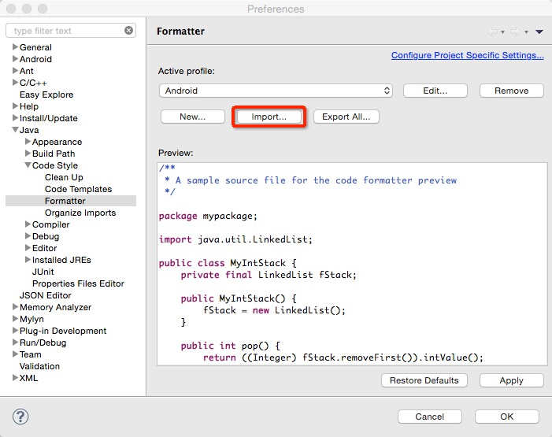
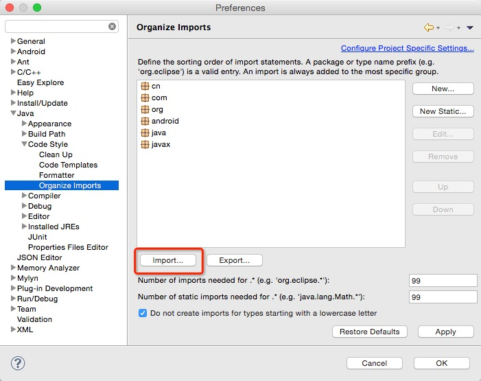

##开发规范

####编码规范

常量用全大写，单词之间用下划线，声明为static final

属性变量以小写m开头，单词采用驼峰格式

静态变量以小写s开头，单词采用驼峰格式

提交代码前，进行代码format和organize

####android code style

将xg_android_format.xml和xg_android.importorder导入eclipse中，导入方法如下图：

